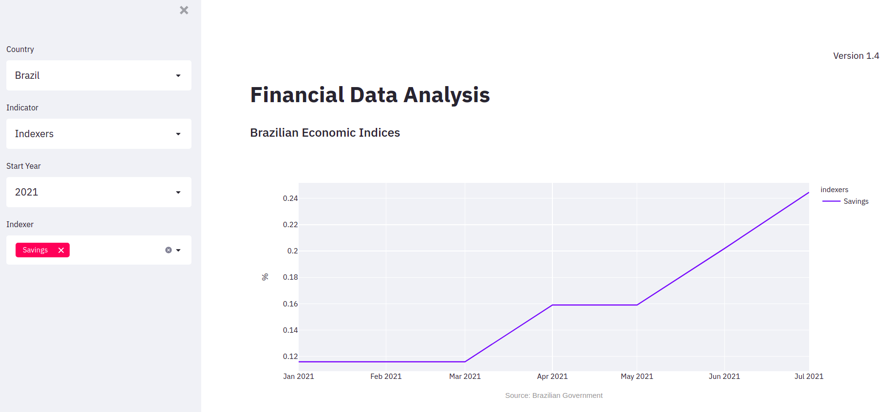

# Brazilian Investiments Analysis

Web App: <a href="https://share.streamlit.io/marcosrmg/investments/src/app.py" target="_blank">Financial Data Analysis</a>

The Web App uses Streamlit as a front-end solution, the objective is to visualize the main indicators of the Brazilian economy and the historical stock price of Brazilian companies listed on the IBOVESPA.

Information has been collected from Yahoo.com and from public Brazilian government databases.

Streamlit Debugging:

Pandas version is 1.2.4 in requirements.txt to avoid the error: <a href="https://discuss.streamlit.io/t/getiing-an-error-after-deployment-of-streamlit-c/14674" target="_blank">TypeError: _translate() missing 2 required positional arguments: 'sparse_index' and 'sparse_cols'</a>
